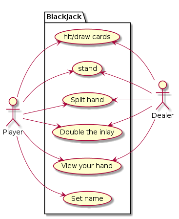

# Documentatie

- [Documentatie](#documentatie)
- [Inleiding](#inleiding)
- [Stijl](#stijl)
- [Use case](#use-case)
- [Class diagram](#class-diagram)


# Inleiding

In dit document, wordt de stijl, de structuur, usecases en verderere documentatie van de applicatie "Blackjack" gedefineerd.

# Stijl

```cs
package Vb {
    class Main {
        private int m_variable;
        private string * mp_string;
        private char & mr_char;

        public static void Main() {

        }
    }
}
```

Alle variable krijgen letters voor de naam, op basis van het type.
|Letter|Uitleg|
|---|---|
|m|Een member variable van de classe|
|r|een referentie naar een andere variabele|
|p|een pointer naar een andere variabele|

# Use case



# Class diagram

